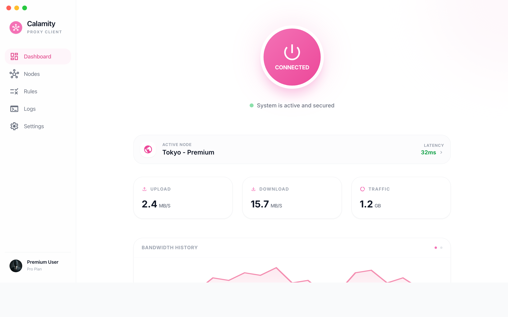
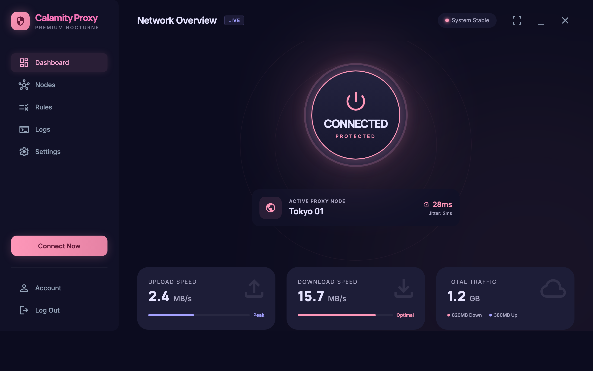
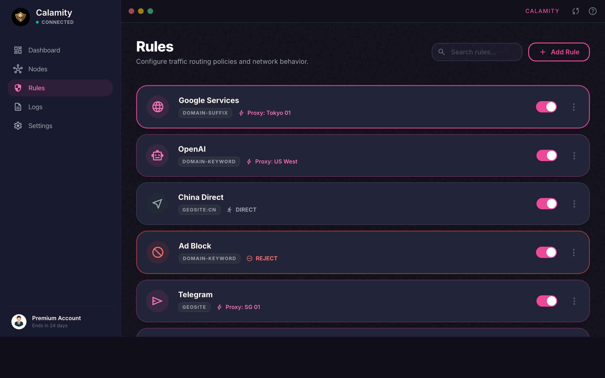
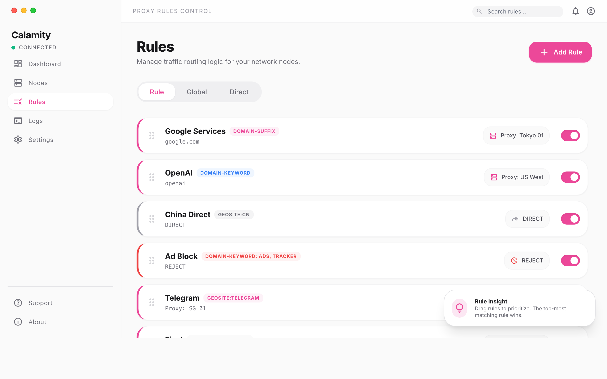
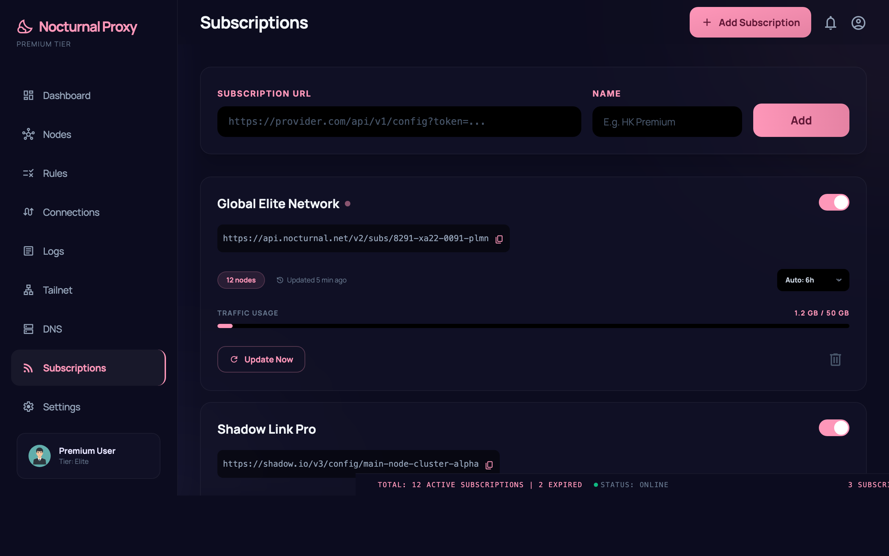
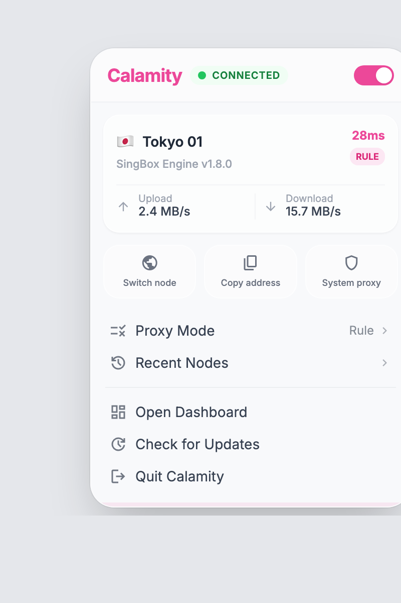

<h1 align="center">
  
  <br>
  Calamity
</h1>

<h3 align="center">
基于 <a href="https://sing-box.sagernet.org/">sing-box</a> 的现代 macOS 代理客户端
</h3>

<p align="center">
  <a href="./README.md">English</a>
  &nbsp;|&nbsp;
  <a href="./README.zh-CN.md">简体中文</a>
</p>

---

## 预览

<table>
  <tr>
    <td></td>
    <td></td>
  </tr>
  <tr>
    <td align="center"><strong>仪表盘</strong> — 亮色模式</td>
    <td align="center"><strong>仪表盘</strong> — 暗色模式</td>
  </tr>
  <tr>
    <td></td>
    <td></td>
  </tr>
  <tr>
    <td align="center"><strong>节点</strong> — 代理分组与节点管理</td>
    <td align="center"><strong>规则</strong> — 路由规则与规则集</td>
  </tr>
  <tr>
    <td></td>
    <td></td>
  </tr>
  <tr>
    <td align="center"><strong>订阅</strong> — 节点订阅管理</td>
    <td align="center"><strong>托盘</strong> — 紧凑快捷窗口</td>
  </tr>
</table>

## 功能特性

**代理核心**

- 三种连接模式：直连、规则、全局代理
- 节点分组与延迟测试（单点 / 批量）
- 代理链支持 — 多节点串联
- 丰富协议支持：VMess、VLESS、Shadowsocks、Trojan、Reality 等

**规则路由**

- 灵活的规则匹配：域名、IP、GeoSite、GeoIP
- 规则反转、Final 出口、按站点快速操作
- 规则集市场 — 一键安装社区规则集

**DNS 管理**

- 完整的 DNS 服务器管理与自定义上游
- TUN 模式下的 Fake-IP 支持
- 根据路由配置自动生成 DNS 分流规则
- DNS 劫持支持（sing-box 1.12+）

**TUN 模式**

- 原生 macOS TUN，自动处理管理员权限
- 可配置 stack、MTU、auto-route、strict-route、DNS 劫持
- 退出时自动清理 Fake-IP 并释放 TUN 接口

**订阅管理**

- 多订阅管理，支持自动更新
- Clash YAML 订阅解析
- 并发拉取，共享 HTTP 客户端

**Tailscale 集成**

- OAuth 设备管理
- 出口节点切换、ACL 标签、MagicDNS 支持
- 自动注入 Tailscale 路由和 DNS 规则到 sing-box 配置

**界面体验**

- 实时流量图表、速度、内存、连接数仪表盘
- 紧凑托盘窗口，快速切换模式和状态监控
- 暗色主题，毛玻璃效果
- 中英双语界面
- 拖拽排序规则和节点

## 安装

| 系统 | 架构 | 最低版本 |
|:---|:---|:---|
| macOS | Apple Silicon (aarch64) | macOS 10.15+ |

前往 [**Releases**](https://github.com/Kotodian/calamity/releases) 下载最新 `.dmg` 安装包。

> **注意**：安装后 macOS 可能会阻止运行。右键选择"打开"以跳过 Gatekeeper，或执行：
> ```bash
> xattr -cr /Applications/Calamity.app
> ```

## 开发

```bash
# 安装依赖
npm install

# 仅启动前端（localhost:1420）
npm run dev

# 启动完整桌面应用
npm run tauri dev

# 构建
npm run build

# 测试
npm test
cargo test --manifest-path src-tauri/Cargo.toml
```

## 致谢

- [sing-box](https://github.com/SagerNet/sing-box) — 通用代理平台
- [Tauri](https://tauri.app/) — 桌面应用框架
- [Clash Verge Rev](https://github.com/clash-verge-rev/clash-verge-rev) — UI/UX 设计灵感
- [Tailscale](https://tailscale.com/) — Mesh VPN 集成

## 贡献

贡献前请阅读 [AGENTS.md](./AGENTS.md)，了解仓库约定与代码规范。

## 许可证

[MIT License](./LICENSE) © 2026 Kotodian
