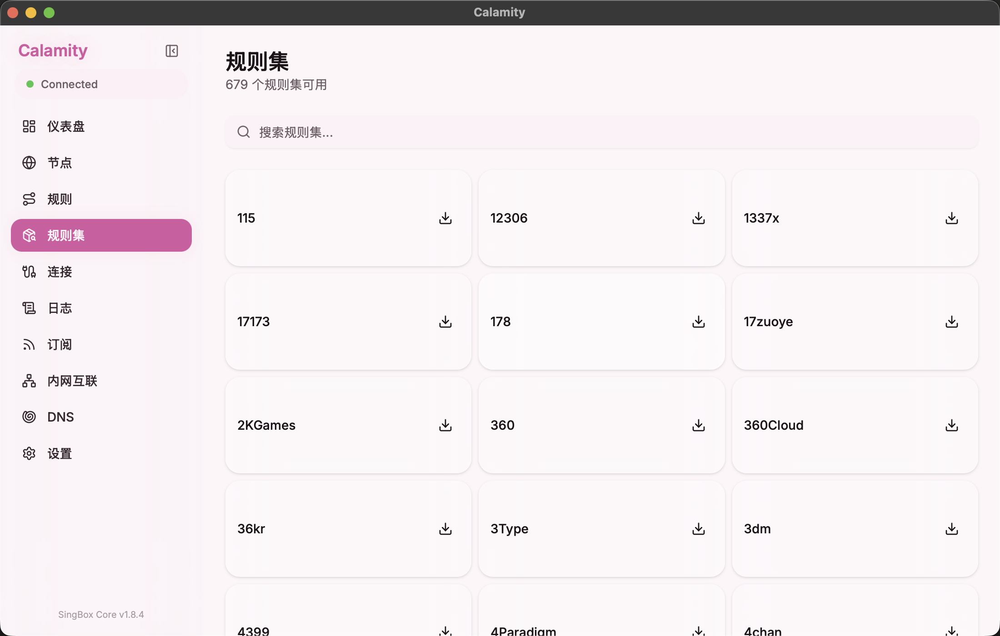
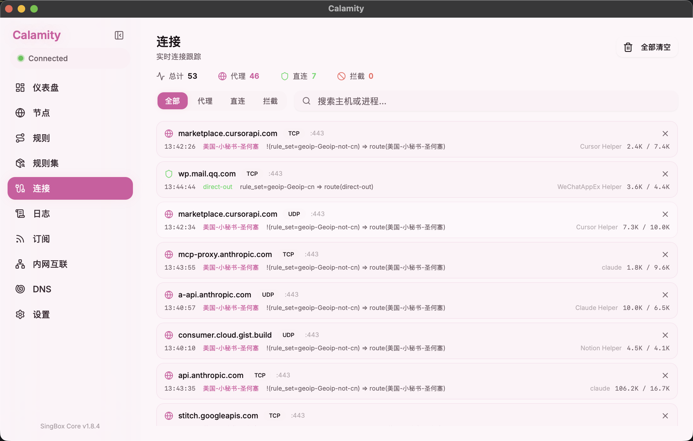
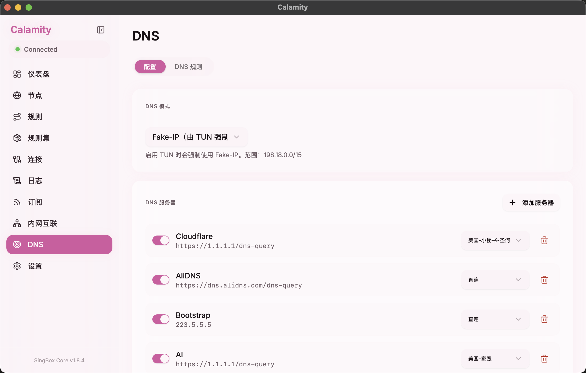
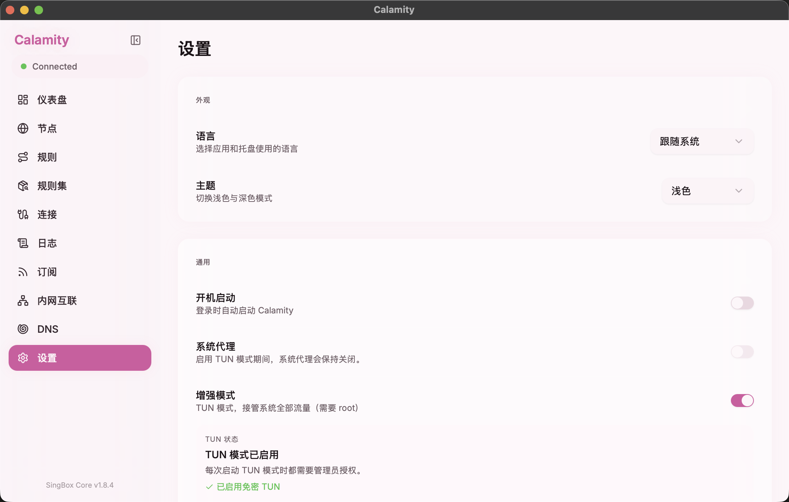
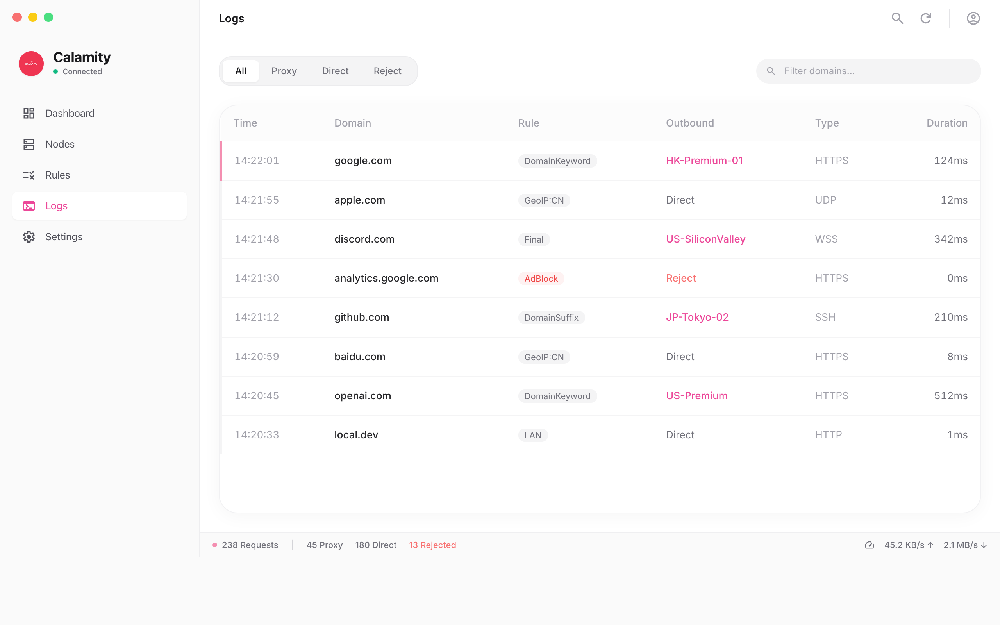

# Calamity 操作指南

> 基于 [sing-box](https://sing-box.sagernet.org/) 的现代 macOS 代理客户端

---

## 目录

- [安装与启动](#安装与启动)
- [仪表盘](#仪表盘)
- [节点管理](#节点管理)
- [规则配置](#规则配置)
- [规则集市场](#规则集市场)
- [连接监控](#连接监控)
- [订阅管理](#订阅管理)
- [DNS 配置](#dns-配置)
- [设置](#设置)
- [日志与排障](#日志与排障)

---

## 安装与启动

1. 从 [Releases](https://github.com/Kotodian/calamity/releases) 下载最新 `.dmg` 安装包
2. 拖拽 Calamity.app 到 Applications 文件夹
3. 首次打开如被 macOS 拦截，右键选择"打开"或终端执行：

```bash
xattr -cr /Applications/Calamity.app
```

4. 启动后主窗口自动加载配置并启动 sing-box 核心
5. 关闭主窗口只是隐藏，需要在托盘中点击"退出"才会完整退出

---

## 仪表盘


仪表盘是启动后的首页，提供以下信息：

- **连接状态** — 中央电源按钮显示已连接/已断开
- **实时速率** — 上传和下载的实时速度
- **流量统计** — 当前会话总流量
- **连接数 / 内存 / 运行时长** — sing-box 核心状态
- **带宽历史** — 最近 5 分钟的速率图表

---

## 节点管理


### 基本操作

1. 点击侧边栏「节点」进入节点管理
2. 使用 `Proxy` / `Test` 标签切换代理和测试节点
3. 使用区域标签（All / HK / JP / US / SG / KR / DE / GB）筛选节点
4. 点击节点卡片将其设为活跃节点，应用自动重启 sing-box 切换连接
5. 点击右上角「测试全部」批量测延迟

### 节点分组

点击「新分组」创建分组，支持普通分组和 `urltest` 自动测速分组。

### 连接稳定性

页面下方图表展示当前活跃节点的延迟波动，包括平均延迟和抖动值。

> **提示：** 切换节点后如果连接失败，先执行一次延迟测试确认节点可用。

---

## 规则配置


规则定义流量的路由策略，从上到下匹配，命中后走对应出口。

### 操作步骤

1. 点击右上角「添加规则」新建规则
2. 设置匹配类型：`geoip`、`geosite`、`process-path`、`rule-set` 等
3. 选择出口策略：指定代理节点 / `直连` / `拒绝`
4. 用开关启用或禁用单条规则
5. 用铅笔图标编辑，垃圾桶图标删除

### 最终出口

页面顶部的「最终出口」决定未匹配流量的走向，可设为直连、代理或拒绝。

> **注意：** 规则顺序很重要，排在前面的优先级更高。

---

## 规则集市场



规则集市场提供大量预配置规则集，无需手动逐条配置。

1. 点击侧边栏「规则集」进入市场
2. 搜索框输入名称搜索（如 Google、Twitter、Telegram）
3. 点击下载图标一键安装
4. 安装后在规则页面通过 `rule-set` 类型引用

---

## 连接监控



实时展示所有经过 sing-box 的网络连接。

- **连接统计** — 顶部显示总数，分类显示代理/直连/拒绝
- **筛选标签** — 按全部/代理/直连/拒绝分类查看
- **搜索** — 按主机名或进程名搜索
- **连接详情** — 目标地址、端口、协议、匹配规则、出口节点、流量
- **关闭连接** — 点击 × 断开单条，右上角「全部清空」断开全部

---

## 订阅管理


### 添加订阅

1. 顶部输入框粘贴订阅地址
2. 右侧填写名称
3. 点击「添加」

### 管理订阅

- **启用/禁用** — 开关控制订阅是否生效
- **手动更新** — 点击「立即更新」拉取最新节点
- **全部更新** — 右上角一次性更新所有订阅
- **自动更新** — 每个订阅可设置自动更新间隔（如 12h）

> **提示：** 更新订阅后检查当前活跃节点是否仍存在，被移除的节点需重新选择。

---

## DNS 配置



分为「配置」和「DNS 规则」两个标签页。

### DNS 模式

TUN 模式开启时强制使用 `Fake-IP`，范围 `198.18.0.0/15`。

### DNS 服务器管理

1. 点击「添加服务器」新增 DNS 上游
2. 支持 UDP、DoH（`https://`）、DoT 等协议
3. 为每个服务器指定出口节点（直连或代理）
4. 左侧开关启用/禁用，红色图标删除

> **注意：** 至少保留一个可靠的 DNS 服务器（如 Cloudflare 1.1.1.1 或 AliDNS）。

---

## 设置



### 外观

- **语言** — 跟随系统 / 简体中文 / English
- **主题** — 浅色 / 深色

### 通用

- **开机启动** — 登录时自动启动 Calamity
- **系统代理** — 启用系统级代理
- **增强模式（TUN）** — 接管系统全部流量，需要 root 权限

### TUN 模式

TUN 通过虚拟网络接口接管所有系统流量，比系统代理覆盖范围更广。

1. 开启「增强模式」开关
2. 首次需输入系统密码完成管理员授权
3. 启用后显示「TUN 模式已启用」

> **注意：** TUN 模式开启后系统代理自动关闭。只需浏览器走代理时优先用系统代理。

---

## 日志与排障



### 日志功能

- **级别筛选** — 全部 / 调试 / 信息 / 警告 / 错误
- **搜索** — 过滤包含特定关键词的日志
- **自动滚动** — 底部开关实时跟踪最新日志
- **清空** — 右上角清除所有记录

### 排障步骤

1. 确认 sing-box 是否启动 — 日志中应有 `[calamity] connected to sing-box`
2. 确认是否有活跃节点 — 没有节点则无法代理
3. 检查规则「最终出口」和各条规则的出口
4. 检查 DNS 模式和上游服务器
5. TUN 模式下确认管理员授权和退出清理是否正常

> **排障顺序：** 切换节点 → 更新订阅 → 检查规则 → 查看日志错误信息
